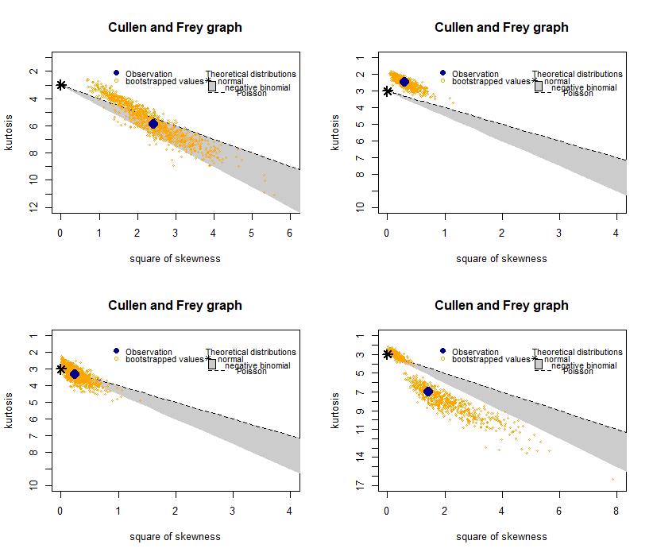

### GiGo principle

GiGo principle is a common concept in computer science stating that the quality of output is determined by the quality of input.
In this section, we walk through the phases of Input Modeling adopted in order to to come up with approximations that best represent the system.

### The treasure chest box

Boxes in the adventure field (the map) appear at different rarities and different numbers. Our goal in this section is to find the underlying distribution for boxes counts

