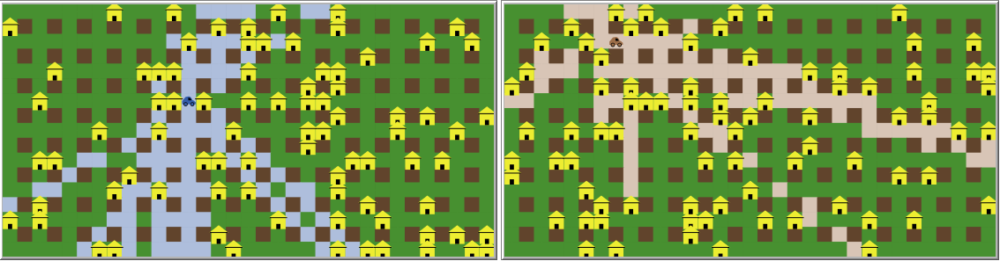

## Map Generation

  

## Search Mechanism: ISOVIST
In order for the bomber to aim for a reward spot, it needs first to locate it. The idea behind the search process is that the bomber will "look around" and choose a spot within its "visible area". To do so we implemented an ISOVIST assisted search.

The term describes the visibility from a specific point within a space. It is a geometric representation of the visible space or field of view from a given location. The term "isovist" is derived from the words "isos" (meaning equal) and "vist" (meaning view).

As depicted bellow, the highlighted area is the spots visible to the bomber and from which it can pick a target. To accomodate the topology of the map and ensure maximum covrage of the space, the only blockage set fo visibility is the houses. 

  

