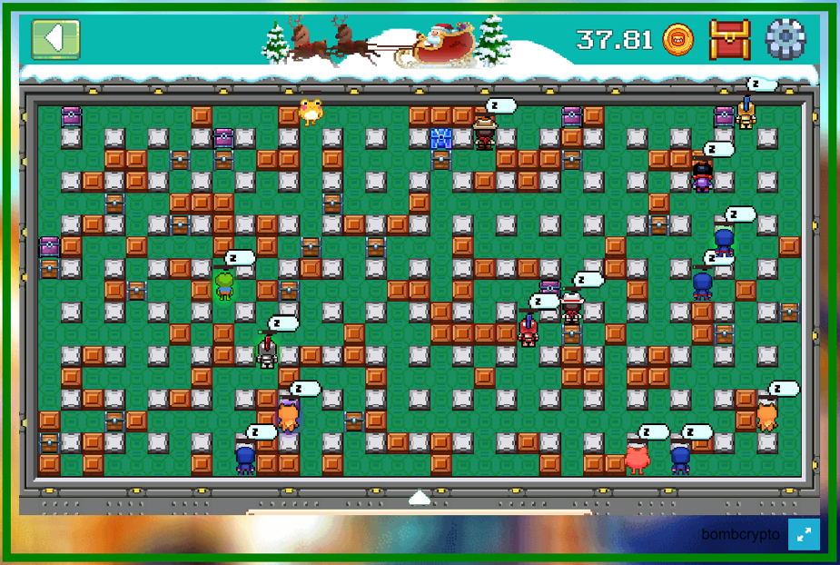

In this project I aimed to model and simulate a Play-to-Earn game "BombCrypto" using an Agent Based Approach.

## the game

In the Treasure Hunt mode the players manage a group of Bombers programmed to destroy treasure chests and collect rewards. Each treasure chest type has a different abundunce and reward whereas bombers have different stats (inventory|stamina|power|scoop|speed) and the player can choose to put the bomber to work or send it to rest where it builds inventory.

After capturing the game dynamics and the reward mecanism, an Agent Based Model of the game was build and Input Modeling was carried out to adequately represent the input data.

