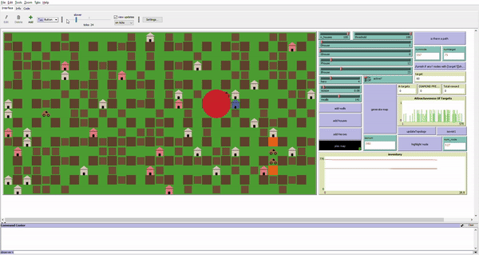

In this project we aimed to model and simulate a Play-to-Earn game "BombCrypto" using an Agent Based Approach.

## The Game

In the Treasure Hunt mode the players manage a group of Bombers programmed to destroy treasure chests and collect rewards. Each treasure chest type has a different abundunce and reward whereas bombers have different stats (inventory|stamina|power|scoop|speed) and the player can choose to put the bomber to work or send it to rest where it builds up inventory.

You can check the video at the link https://www.youtube.com/watch?v=qFhVbF6fmVE&ab_channel=%D8%B3%D9%88%D9%82%D8%A7%D9%84%D8%B3%D9%8A%D8%A7%D8%B1%D8%A7%D8%AA

After capturing the game dynamics and the reward mecanism, an Agent Based Model of the game was build and Input Modeling was carried out to adequately represent the input data.

